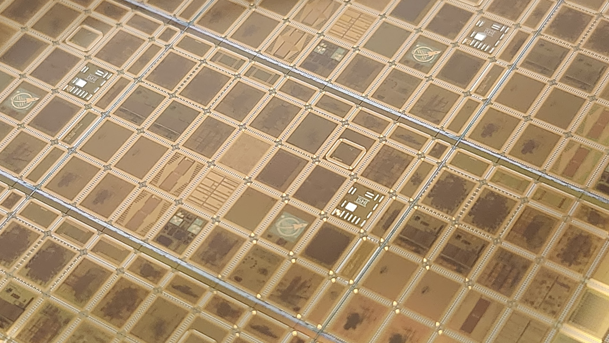

# wafer_space_docker_based_starter_kit

**Design your own custom chip — simulate it, verify it, and produce a manufacturable layout — without ever having made a chip before.**

<p align="center">
  <br>
  <sub><i>A full reticle from <a href="https://wafer.space">wafer.space</a>'s first GF180MCU
  run (Shuttle&nbsp;G801) — browse those 40 designs in the
  <a href="https://github.com/wafer-space/ws-run1">Run&nbsp;1 projects repo</a>.</i></sub>
</p>

---

## Targeting [wafer.space](https://wafer.space)

This kit exists to take a design all the way to a **[wafer.space](https://wafer.space)** shuttle. wafer.space is a *budget silicon-manufacturing* service — its tagline is **"create integrated circuits without breaking the bank."** It runs shared **GF180MCU** (GlobalFoundries 180 nm) **shuttles**: many independent designs share a single wafer, so you buy one **slot** instead of paying for a whole manufacturing run. You design, simulate, and verify your chip with this kit, then submit the resulting GDSII to a wafer.space shuttle, which returns physical dies (with optional chip-on-board packaging or full undiced-wafer delivery).

**Useful links:** [wafer.space](https://wafer.space) · [Buy a slot / current pricing](https://buy.wafer.space) · [Discord community](https://discord.gg/43y2t53jpE) · [GitHub org](https://github.com/wafer-space) · [Project template](https://github.com/wafer-space/gf180mcu-project-template) · [Submission precheck](https://github.com/wafer-space/gf180mcu-precheck) · [Run 1 projects](https://github.com/wafer-space/ws-run1)

> Pricing, slot sizes, and submission rules live on wafer.space and change between shuttles — always confirm the current details there.

---

## What is this?

This is a self-contained starter kit for designing a small digital chip on the open-source **GF180MCU** process (GlobalFoundries 180 nm) and pushing it all the way to **GDSII** (the file a fab turns into silicon), targeting a **wafer.space** shuttle slot. Everything runs in Docker — you do not need to install any chip-design software by hand.

It ships a tiny, complete, **working example chip** (a heartbeat + counter "core") that already simulates green and hardens to a clean layout out of the box. Your job is to replace its insides with your own design. We hold your hand the whole way.

> **New to all of this?** Read [`docs/00_ASIC_FOR_BEGINNERS.md`](docs/00_ASIC_FOR_BEGINNERS.md) first — it explains every word above (PDK, GDSII, shuttle…) with zero assumed knowledge.

## Who is this for?

You. Specifically: someone who has **never made a chip before** and wants to. You do not need a PhD, an expensive tool license, or prior chip-design experience. If you can install Docker and copy-paste a few commands, you can get a real, manufacturable chip layout on your screen. Every step below has a clear "you should see this" success signal so you always know whether it worked.

## Status

- ✅ **Simulation image builds** with one command (`make build-sim`).
- ✅ **Example chip simulates green** — the scaffold passes its self-check with zero mismatches.
- ✅ **Hardens to a clean GDSII** — the example produces a manufacturable layout (DRC, LVS, and antenna all passing) for the default `1x0p5` slot.

---

## 5-Minute Quickstart

The fastest path from nothing to a **green simulation** — proof the whole kit works on your machine. This is the short version; for the same steps with a success signal explained at each stage, follow [`docs/01_GETTING_STARTED.md`](docs/01_GETTING_STARTED.md) instead.

```bash
# 1. Get the code
git clone https://github.com/evezor/wafer_space_docker_based_starter_kit.git
cd wafer_space_docker_based_starter_kit

# 2. Build the simulation image (one-time; a few minutes)
make build-sim

# 3. Simulate the example chip — the moment of truth
make sim
```

> ✅ **Green light:** `make sim` ends with `OK: scaffold chip_core matched golden` and exits 0. **If you got here, the kit works on your machine.**

#### Optional — produce a real layout

```bash
make pdk        # fetch the GF180MCU PDK (multi-GB, one-time)
make harden     # RTL → GDSII for the default slot (takes a while)
```

> ✅ A clean layout lands at `final/gds/chip_top.gds` with `Antenna / LVS / DRC Passed`. Full walkthrough → [`docs/07_HARDENING_GUIDE.md`](docs/07_HARDENING_GUIDE.md).

You just ran the same pipeline a real tapeout uses — RTL → simulate → verify → harden → signoff — so the only new variable when you swap in your own design is the design itself. The pipeline explained stage by stage → [`docs/04_THE_FLOW.md`](docs/04_THE_FLOW.md).

---

## Directory map

```
wafer_space_docker_based_starter_kit/
├── README.md                  # you are here
├── docker-compose.yml         # the two containers: sim + harden
├── .env.example               # PDK_ROOT, SLOT, image tags, PDK commit — copy to .env
├── .gitignore                 # ignore PDK download, run outputs, *.gds, *.vcd, generated defines
├── Makefile                   # all the make targets (run `make` to see help)
├── flake.nix                  # Path B (advanced): Nix dev shell for hardening
├── shell.nix                  # Path B: flake-compat shim (for direnv / nix-shell)
├── flake.lock                 # Path B: pinned Nix inputs (single source of truth)
├── docker/
│   ├── Dockerfile.sim         # the simulation image (Ubuntu + Icarus + Python/cocotb)
│   └── Dockerfile.harden      # Path A: thin wrapper over the official LibreLane image
├── scripts/
│   ├── sim.sh                 # the one Docker wrapper (mounts the repo at /work; path-safe on Windows)
│   ├── harden.sh              # runs LibreLane in the harden container
│   └── gen_defines.sh         # emits src/generated_defines.svh from $SLOT
├── src/
│   ├── chip_core.sv           # ◄── THE FILE YOU EDIT: your design goes here (ships as a heartbeat stub)
│   ├── chip_top.sv            # pad ring / template top (DO NOT EDIT — do not rename ports)
│   ├── slot_defines.svh       # per-slot pad budgets (1x0p5 = 4 in / 46 bidir / 4 analog)
│   └── generated_defines.svh  # auto-generated by `make defines` (gitignored)
├── tb/                        # self-checking testbenches (Icarus)
├── models/                    # golden reference model(s) + committed golden vectors
├── cocotb/                    # optional pad-level Python testbench (needs PDK)
├── librelane/                 # hardening config: config.yaml, slots/, macros/, pdn/
├── ip/                        # where to get wafer.space tapeout IP (ids/logo/marker)
├── final/                     # GDSII + signoff deliverables land here (gitignored)
└── docs/                      # all the guides (see the documentation map below)
```

> ℹ️ The **one file you edit** is `src/chip_core.sv`. Everything in `src/chip_top.sv` (the pad ring and tapeout IP) is do-not-edit — touching it can break the layout. See [`docs/06_CONTINUE_THE_DESIGN.md`](docs/06_CONTINUE_THE_DESIGN.md) for the full "make it yours" guide.

---

## Documentation map

These run from concepts, to a submitted sample, to designing your own — read in order.

| Read in this order | Doc | What's in it |
|---|---|---|
| 1 | [`docs/00_ASIC_FOR_BEGINNERS.md`](docs/00_ASIC_FOR_BEGINNERS.md) | Plain-English concepts: PDK, RTL, GDSII, DRC/LVS, tapeout. No tools. |
| 2 | [`docs/01_GETTING_STARTED.md`](docs/01_GETTING_STARTED.md) | Install prerequisites, clone, get the sim green, and harden the sample. |
| 3 | [`docs/02_WAFERSPACE_SUBMISSION.md`](docs/02_WAFERSPACE_SUBMISSION.md) | Submit the hardened sample: slot sizes, pinout/bond-out, tapeout cells, precheck, checklist. |
| 4 | [`docs/03_PATHS_TO_A_WAFERSPACE_DIE.md`](docs/03_PATHS_TO_A_WAFERSPACE_DIE.md) | Orientation — what wafer.space is, the direct vs hosted paths onto a shuttle, what every die needs. |
| 5 | [`docs/04_THE_FLOW.md`](docs/04_THE_FLOW.md) | The full pipeline stage by stage, with a diagram and file/command map. |
| 6 | [`docs/05_ANATOMY_OF_THE_SAMPLE.md`](docs/05_ANATOMY_OF_THE_SAMPLE.md) | A file-by-file anatomy of the shipped example: what it does and exactly where each behavior and its golden-model check live. |
| 7 | [`docs/06_CONTINUE_THE_DESIGN.md`](docs/06_CONTINUE_THE_DESIGN.md) | **The "how to make it yours" guide** — edit `chip_core.sv`, add tests, grow. |
| 8 | [`docs/07_HARDENING_GUIDE.md`](docs/07_HARDENING_GUIDE.md) | Path A (Docker) vs Path B (Nix), exact harden commands, reading results, getting your files out of the container. |
| 9 | [`docs/08_TROUBLESHOOTING.md`](docs/08_TROUBLESHOOTING.md) | Real problems and fixes from a proven run. |

---

## Going further

Want the upstream, fully-featured version this kit is built on? The [wafer.space project template](https://github.com/wafer-space/gf180mcu-project-template) is the canonical GF180MCU tapeout template (Nix-based). This kit adds the Docker path, the beginner docs, and a known-green example core. [`docs/06_CONTINUE_THE_DESIGN.md`](docs/06_CONTINUE_THE_DESIGN.md) points to the parts of the upstream template worth reading.

Before you submit a real design to a shuttle, you run a **precheck** — an automated set of checks that catches common submission problems early. The wafer.space precheck lives at [gf180mcu-precheck](https://github.com/wafer-space/gf180mcu-precheck); [`docs/02_WAFERSPACE_SUBMISSION.md`](docs/02_WAFERSPACE_SUBMISSION.md) walks you through running it. Run it with the `--cob` flag to verify your pad layer matches the chip-on-board padring for your slot — this check will soon be enforced on the submission platform.

---

## Credits

Built on the [wafer.space `gf180mcu-project-template`](https://github.com/wafer-space/gf180mcu-project-template), and on a deep, open-source toolchain:

**GF180MCU PDK · LibreLane · OpenROAD · Yosys · Magic · KLayout · Netgen**

Thank you to everyone who makes open-source silicon possible.

## License

Apache-2.0. See [`LICENSE`](LICENSE).
