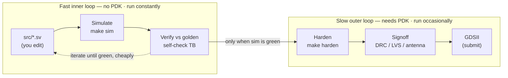

# 02 · The Flow

This page explains the end-to-end pipeline one stage at a time, so that at any moment you know *where you are* and *what you are trying to prove*. If [`00_ASIC_FOR_BEGINNERS.md`](00_ASIC_FOR_BEGINNERS.md) taught you the words, this page shows you how they connect.

---

## The big picture

Every chip in this kit travels the same road: you **edit** RTL, **simulate** it to check the logic, **verify** it against a golden reference, **harden** it into a layout, **sign it off** with the manufacturability checks, and ship the **GDSII**. The first three stages are fast and need no PDK; the last three are slow and heavy. Here is the whole journey on one screen:



> **The key idea:** the left half (edit → simulate → verify) is fast, free, and needs no PDK — you do it hundreds of times. The right half (harden → signoff → GDSII) is slow and heavy — you do it occasionally, *only after the left half is green*. Catching a bug in simulation costs seconds; catching it after hardening costs hours.

---

## Stage 1 — Edit RTL

This is where your design lives. You write your logic in SystemVerilog inside `src/chip_core.sv` (and any extra `.sv` files your design needs). `chip_core.sv` is **the one file you edit** — it ships as a simple heartbeat/counter stub so the kit works out of the box, and you replace its insides with your own design. The surrounding `src/chip_top.sv` (the pad ring and tapeout IP) is do-not-edit, so you never have to worry about the chip's outer plumbing.

## Stage 2 — Simulate

Simulation runs your RTL as software and shows you what it does, **with no PDK and no physical layout**. It is fast — seconds — and it is where you spend most of your time. You run it with `make sim` (or its alias `make test`), which uses Icarus Verilog inside the sim container. This stage proves your logic actually *runs* and behaves the way you expect.

## Stage 3 — Verify against a golden model

Simulating proves your design *does something*; verifying proves it does the *right* thing. The pattern this kit uses is a **golden vector**: a separate, simple reference model (in Python, under `models/`) computes the expected output, and the testbench demands a **bit-exact, 0-mismatch** match. The example's own test prints exactly that:

```
==== 256 samples checked, 0 mismatches ====
OK: scaffold chip_core matched golden
```

That is 256 out of 256 samples matched, with zero mismatches. This golden-model habit is the single most important thing to carry into your own design — see [`03_CONTINUE_THE_DESIGN.md`](03_CONTINUE_THE_DESIGN.md) for how to add your own reference model and test.

## Stage 4 — Harden

**Hardening** is turning RTL into a physical layout: synthesis → floorplan → placement → clock-tree → routing → GDSII, all orchestrated by LibreLane. This stage **needs the PDK** (run `make pdk` once first), and it is slow — minutes for the tiny example, much longer for a real design. You kick it off with `make harden`. The list of source files it builds from comes from `librelane/config.yaml`.

## Stage 5 — Signoff

Once a layout exists, the tools run the **signoff** checks that decide whether it is manufacturable: **DRC** (geometry is legal), **LVS** (layout matches the netlist), and **antenna** (no charge-damaged gates), plus density and power-grid checks. You read the results in the run's manufacturability report. A clean result means every count is **0** and each check reads `Passed`. For the example chip, the proven result is `Antenna Passed`, `LVS Passed`, `DRC Passed`.

## Stage 6 — GDSII deliverable → submission

When signoff is clean, your final layout is at `final/gds/chip_top.gds`. That single file is the deliverable: it is what wafer.space turns into silicon. Before submitting you run a precheck and assemble the bond-out and tapeout-IP details — all covered in [`05_WAFERSPACE_SUBMISSION.md`](05_WAFERSPACE_SUBMISSION.md).

---

## The inner loop vs the outer loop

Think of the flow as two loops:

- **The inner loop (fast, free):** edit → simulate → verify. No PDK, no waiting. You run it constantly while developing your logic. A bug caught here costs seconds.
- **The outer loop (slow, heavy):** harden → signoff → GDSII. Needs the PDK, runs for minutes to hours. You run it only when the inner loop is fully green.

The discipline that makes chip design tractable is simple: **never enter the outer loop until the inner loop passes.** Prove your design is correct in simulation against the golden model first; only then spend the time and resources to harden it. The example proves the whole outer loop already works, so when you swap in your design the only new variable is your logic.

---

## Stage → file → command map

Use this table as a cheat-sheet for "what do I touch and what do I run, at each stage?"

| Stage | You touch | You run | PDK? | Proves |
|---|---|---|---|---|
| 1. Edit RTL | `src/chip_core.sv` (+ your engine `.sv`) | (your editor) | no | — |
| 2. Simulate | `tb/*.sv` | `make sim` | no | logic runs, basic behavior |
| 3. Verify vs golden | `models/`, `tb/` | `make sim` | no | matches the spec, bit-exactly |
| 4. Harden | `librelane/config.yaml` (file list) | `make pdk` then `make harden` | **yes** | RTL→GDSII completes |
| 5. Signoff | (reports in the run dir) | (read the manufacturability report) | yes | DRC / LVS / antenna = 0 |
| 6. GDSII / submit | `final/gds/chip_top.gds` | (upload to wafer.space) | — | ready for fab |

---

## Where to go next

- Ready to make it yours? Go to [`03_CONTINUE_THE_DESIGN.md`](03_CONTINUE_THE_DESIGN.md).
- Want the deep dive on hardening (Path A Docker vs Path B Nix, and reading every report)? Go to [`04_HARDENING_GUIDE.md`](04_HARDENING_GUIDE.md).

---

| ◀ Previous | Up | Next ▶ |
| :--- | :---: | ---: |
| [01 · Getting Started](01_GETTING_STARTED.md) | [Documentation map](../README.md#documentation-map) | [03 · Continue the Design](03_CONTINUE_THE_DESIGN.md) |
