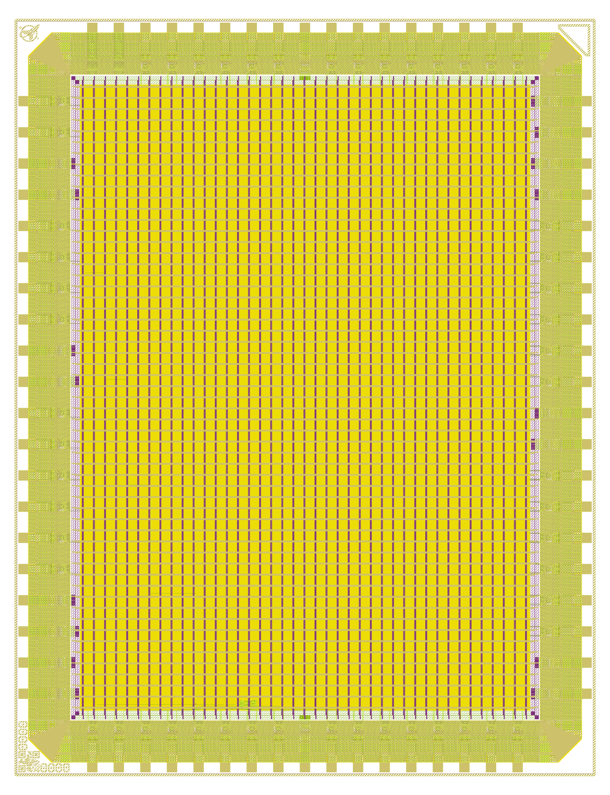

# 05 — Anatomy of the Sample Chip

*Optional — continued learning.* By now you have simulated and maybe hardened the
shipped example. This page is a **map**: it shows exactly *where the example lives in the
repository*, *what it does*, and *which file (and line) defines each behavior*. Read it
when you want to understand the kit deeply enough to start swapping in your own logic with
confidence — it's the bridge between "I ran it" and "I can change it."

The other guides are *how to drive the kit*; this page is *what's under the hood* of the
example you just built. Some of it points outward (to the PDK, to LibreLane) where the
detail quickly exceeds this repo — those are good footholds for learning more.

If a term is new, it was defined the first time it appeared earlier in the docs.

---

## The example in one sentence

The shipped chip is a **gated free-running counter with a heartbeat blink** — a
deliberately trivial design whose real job is to prove the whole RTL → simulate → verify →
harden → GDSII pipeline is green *before you change anything*.

What it actually does, on silicon:

- Hold **input pad 0 high** and an internal 24-bit counter increments every clock; hold it
  low and the chip freezes.
- The **low 8 bits of the counter** appear on bidir pads `[7:0]` so you can watch the count
  on a logic analyzer.
- The counter's **top bit** drives a slow "chip-alive" **heartbeat** toggle on bidir pad
  `[12]` — wire an LED there and it blinks.
- A few bidir pads (`[11:8]`) are configured as inputs purely to demonstrate the direction
  mask; the design doesn't consume them.

That's the entire behavior. Everything below traces each piece back to the file that
defines it.

<p align="center">
  <br>
  <sub><i>The shipped sample, hardened — the <code>chip_top</code> GDS render for the default <code>1x1</code> slot. The ring of cells around the edge is the pad ring and tapeout markers (<code>chip_top.sv</code> — note the QR marker in the top-left corner); the dense rows filling the middle are the heartbeat-counter core (<code>chip_core.sv</code>) placed and routed; the whole die sits inside its seal ring. Everything this page dissects, made physical.</i></sub>
</p>

---

## Where the design lives in the repo

The kit has a lot of files, but the **design itself** — the part that defines *this chip* —
is a small, focused set. Here is the whole thing on one screen, grouped by job:

```
THE DESIGN (the RTL that becomes silicon)
  src/chip_core.sv        ◄── the design: the heartbeat counter        [YOU EDIT]
  src/chip_top.sv             padring + tapeout IP around your core    [do not edit]
  src/slot_defines.svh        pad budget per slot (1x1 = 12/40/2)      [do not edit]

THE SPEC + VERIFICATION (proves the design is correct, no PDK needed)
  models/ref_model.py         golden oracle: the expected answer, in Python   [edit to match]
  models/golden.hex           committed expected outputs (256 values)         [regenerate]
  tb/tb_chip_core.sv          self-checking testbench: DUT vs golden          [you edit]

THE HARDENING CONFIG (turns RTL into a layout)
  librelane/config.yaml       the RTL file list + harden settings       [edit to add files]
  librelane/slots/*.yaml      per-slot floorplan/pad placement          [pick via SLOT]
  librelane/macros/*.yaml     macro/PDN wiring (SRAM etc.)              [only if you add macros]
```

Everything else in the repo is *infrastructure* you rarely touch: `docker/` (the two
container images), `scripts/` (the run wrappers), `Makefile` (the front door),
`final/` (where the GDSII lands), and `docs/` (these guides). The full repo tree is in the
[main README](../README.md#directory-map).

> **The one-line version:** your chip is `src/chip_core.sv`; its definition of "correct" is
> `models/ref_model.py`; the proof is `tb/tb_chip_core.sv`. Those three files are the
> design. The rest is plumbing.

---

## What does what: behavior → the line that defines it

Every behavior listed in "one sentence" above is defined in exactly one place. This table
is the decoder ring — open `src/chip_core.sv` alongside it.

| Behavior | Defined in | How |
|---|---|---|
| The counter, gated by input pad 0 | `src/chip_core.sv` ~L90–95 | `count_en = input_in[0]`; a 24-bit `counter` increments on `posedge clk` only when `count_en` and not in reset |
| Low 8 bits shown on bidir `[7:0]` | `src/chip_core.sv` ~L62, L104–110 | `MIRROR_W = 8`; a clear-then-set `always @(*)` drives `bidir_out[7:0] = counter[7:0]` |
| Heartbeat on bidir `[12]` | `src/chip_core.sv` ~L65, L97, L108 | `HB_BIT = 12`; `heartbeat = counter[23]`; `bout[HB_BIT] = heartbeat` |
| Bidir direction mask (`oe`) | `src/chip_core.sv` ~L75–83 | a `for`-generate sets bits `[11:8]` to input (`oe=0`), the rest to output (`oe=1`); then `bidir_ie = ~bidir_oe` |
| No internal pulls / drive config | `src/chip_core.sv` ~L68–69, L84–87 | `input_pu/pd` and `bidir_cs/sl/pu/pd` all tied to `'0` |
| Unused inputs tied off | `src/chip_core.sv` ~L100–101 | folded into the `_unused` net so `-Wall` stays quiet |
| How many pads exist (12/40/2) | `src/slot_defines.svh` ~L1–13 | the `SLOT_1X1` block; selected by the `SLOT_*` define `make defines` generates |

(Line numbers are approximate — they drift as the file is edited. The comments in
`chip_core.sv` are the authoritative tour; read it top to bottom once.)

The **padring** that wraps all this — one foundry I/O cell per physical pin, plus the
required wafer.space tapeout-marker cells (`qrcode_id`, `shuttle_id`, `project_id`,
`marker`, and the optional `logo`) — lives in `src/chip_top.sv`. It contains no design
logic; it's pure plumbing between the pads and your core, which is why it's a do-not-edit
boundary. The rules are in [`06_CONTINUE_THE_DESIGN.md`](06_CONTINUE_THE_DESIGN.md) and
[`02_WAFERSPACE_SUBMISSION.md`](02_WAFERSPACE_SUBMISSION.md).

---

## How "what it does" is *proven* (the trust chain)

A design that runs isn't necessarily a design that's *correct*. The kit proves correctness
with a **golden-vector** test: an independent model computes the expected answer, and the
testbench demands a bit-exact match. Three files form that chain:

```
 models/ref_model.py   ──run──►  models/golden.hex   ──$readmemh──►  tb/tb_chip_core.sv
 (the spec, in Python)           (256 expected values)               (drives DUT, compares)
```

1. **The oracle — `models/ref_model.py`.** In plain integer math (no floats, bit-exact to
   Verilog) it computes the sequence the chip should produce. With the gate held high, the
   value after the *k*-th increment is `(k + 1)` wrapped to 8 bits — see `run_golden()`
   (~L26–33). Running the script regenerates `models/golden.hex` deterministically.

2. **The golden vector — `models/golden.hex`.** 256 committed hex values, one per line.
   It's checked into git on purpose: regenerating it with **no resulting diff** is itself
   proof you didn't change behavior.

3. **The check — `tb/tb_chip_core.sv`.** This testbench:
   - loads `golden.hex` with `$readmemh` (~L67),
   - asserts the direction mask matches the core's contract — `bidir_oe[7:0]==FF`,
     `bidir_oe[11:8]==0`, `bidir_ie==~bidir_oe` (~L86–97),
   - releases reset, drives `input_in[0]=1` to gate the counter on (~L100),
   - captures `bidir_out[7:0]` every clock for 256 samples and compares each to the golden
     value (~L101–110),
   - prints the verdict and requires **0 mismatches** (~L112–115).

`make sim` ([Makefile target `sim`](../Makefile)) is what ties it together: it compiles
`src/chip_core.sv` + `tb/tb_chip_core.sv` with Icarus Verilog and runs the result.

> **You should see** the run end with:
>
> ```
> ==== 256 samples checked, 0 mismatches ====
> OK: scaffold chip_core matched golden
> ```
>
> 256 of 256 samples matched — that's the green light. This is the same
> spec-model-and-check pattern you carry into your own design (see
> [`06_CONTINUE_THE_DESIGN.md`](06_CONTINUE_THE_DESIGN.md)).

---

## When you make it *your* project: what to edit, and why

Mapping intent → the file that owns it. This is the "I want to change X, where do I go?"
index; the full rules and the pad contract are in
[`06_CONTINUE_THE_DESIGN.md`](06_CONTINUE_THE_DESIGN.md).

| You want to… | Edit | Why that file |
|---|---|---|
| Change what the chip **does** | `src/chip_core.sv` | the one design file behind the padring; keep its port list + pad-config assigns intact |
| Change what **"correct" means** | `models/ref_model.py`, then regenerate `models/golden.hex` | it's the independent spec the test trusts |
| Change the **test scenario / checks** | `tb/tb_chip_core.sv` | it drives the DUT and compares to the golden vector |
| **Add** more RTL `.sv` files | `librelane/config.yaml` (`VERILOG_FILES`) **and** `cocotb/chip_top_tb.py` | so the harden flow and the pad-level sim both see the new files |
| Target a **different slot** | pass `SLOT=…` to `make` (don't hand-edit pad counts) | it picks the budget from `src/slot_defines.svh` via `make defines` |
| Touch the **padring or tapeout IP** | `src/chip_top.sv` | **don't** — it's a do-not-edit boundary; editing it can break the layout or tapeout |

The discipline that makes this tractable: **stay in the fast inner loop** (edit
`chip_core.sv` → `make sim` → fix → repeat, seconds per cycle, no PDK) and only
`make harden` once simulation is green. That loop and the reasoning behind it are in
[`04_THE_FLOW.md`](04_THE_FLOW.md).

---

## Footholds for going further

This page is the edge of what *this* repo teaches. To go deeper:

- **The pad contract and growing the design** — [`06_CONTINUE_THE_DESIGN.md`](06_CONTINUE_THE_DESIGN.md).
- **Hardening internals** (synthesis → floorplan → route → signoff) — [`07_HARDENING_GUIDE.md`](07_HARDENING_GUIDE.md) and the [LibreLane docs](https://librelane.readthedocs.io).
- **Slots, pinout, and tapeout cells** — [`02_WAFERSPACE_SUBMISSION.md`](02_WAFERSPACE_SUBMISSION.md).
- **The upstream production template** this kit is built on — [gf180mcu-project-template](https://github.com/wafer-space/gf180mcu-project-template).

---

| ◀ Previous | Up | Next ▶ |
| :--- | :---: | ---: |
| [04 · The Flow](04_THE_FLOW.md) | [Documentation map](../README.md#documentation-map) | [06 · Continue the Design](06_CONTINUE_THE_DESIGN.md) |
